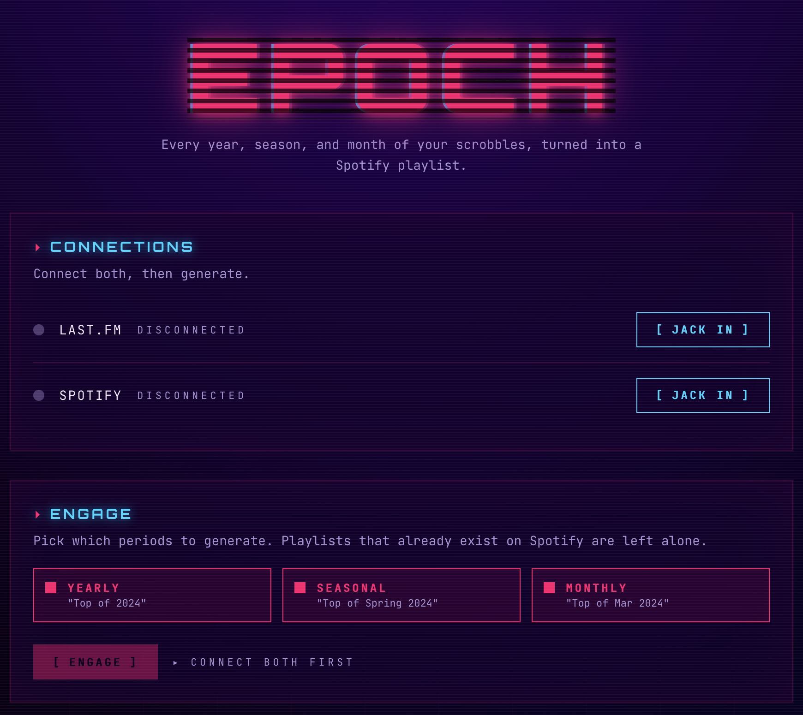

# epoch

Build Spotify playlists from your Last.fm scrobbles, sliced into yearly, seasonal, and monthly "Top of …" lists. Background-job driven, with a small dark-mode UI for kicking off generations and fixing mismatched tracks.



## What it does

- Pulls your Last.fm listening history from your first scrobble to today
- For each year, season (Spring/Summer/Autumn/Winter), and month, asks Last.fm for your top tracks in that window
- Searches Spotify for each track, builds a playlist with the matches
- Skips windows that already have a playlist with the same name; skips windows with too few scrobbles or too few Spotify matches
- Optionally writes the same selection as Aurral-format JSON to a shared volume so [Aurral](https://github.com/lklynet/aurral) can route the tracks through Lidarr → Soulseek → Navidrome
- Records every created playlist + the original Last.fm artist/title alongside its Spotify match so a wrong match can be corrected via the UI

## Architecture

```
                  ┌─ NestJS API ──────────────────────────┐
  Browser ─────►  │  /api/v1/status  POST /api/v1/jobs/gen │
                  │  /api/v1/playlists    /api/v1/jobs/:id│  ───►  Last.fm API
                  │  /spotify/...    GET  /metrics        │  ───►  Spotify API
                  │  /lastfm/...     GET  /health         │
                  └───┬──────────────────┬───┬────────────┘
                      │                  │   │
                      ▼                  ▼   ▼
            ┌─────────────┐      ┌──────┐ ┌───────┐
            │  BullMQ     │ ◄──► │ Mongo│ │ Redis │
            │  worker     │      │      │ │       │
            └─────────────┘      └──────┘ └───────┘
                Generation       Playlists Sessions +
                runs here        + tracks   job queue
```

- **Sessions** live in Redis (HttpOnly + SameSite cookies, 30-day TTL)
- **Spotify token refresh** is automatic — the `SpotifyHttpClient` refreshes preemptively within 60 s of expiry, and on any 401 retries the request once
- **Rate limiting** via Bottleneck (4 concurrent / 100 ms / 50 reqs per 5 s) plus respect for `Retry-After` on 429
- **Background generation** via BullMQ — `POST /jobs/generate` returns `{jobId}` immediately; the worker streams progress messages into the job state for the UI to poll

## Quick start (local dev)

Requires Docker + Docker Compose.

```bash
cp .env.dist .env
# Fill in:
#   LASTFM_API_KEY  + LASTFM_SHARED_SECRET   (https://www.last.fm/api/account/create)
#   SPOTIFY_CLIENT_ID + SPOTIFY_CLIENT_SECRET (https://developer.spotify.com)
#   SESSION_SECRET   (openssl rand -hex 32)
#   PUBLIC_URL       (http://localhost:5342 for local)

docker compose -f docker-compose.dev.yml up
```

Open http://localhost:5342, connect Last.fm + Spotify, hit "Generate playlists".

In your Spotify app dashboard, add `http://localhost:5342/spotify/callback` as an allowed redirect URI.

## Configuration

| Env var | Required | Default | Notes |
|---|---|---|---|
| `LASTFM_API_KEY` | yes | — | from last.fm/api |
| `LASTFM_SHARED_SECRET` | yes | — | from last.fm/api |
| `SPOTIFY_CLIENT_ID` | yes | — | from developer.spotify.com |
| `SPOTIFY_CLIENT_SECRET` | yes | — | from developer.spotify.com |
| `SESSION_SECRET` | yes | — | 32+ random bytes |
| `PUBLIC_URL` | yes in prod | `http://localhost:5342` | external URL the app is reachable at; OAuth callbacks use this |
| `MONGODB_URI` | yes | — | full mongodb:// URI including auth |
| `REDIS_URL` | no | `redis://redis:6379` | shared by sessions + BullMQ |
| `PORT` | no | `5342` | HTTP listen port |
| `AURRAL_EXPORT_DIR` | no | unset | when set, each created playlist is also written as Aurral-format JSON here |
| `SEASONS_HEMISPHERE` | no | `north` | `north` or `south`; same dates, swapped names |

## API

| Method | Path | Notes |
|---|---|---|
| GET | `/health` | liveness, returns `{status:"ok"}` |
| GET | `/metrics` | Prometheus exposition |
| GET | `/api/v1/status` | session connection state + login URLs |
| GET | `/lastfm/callback` | OAuth — redirects to `/` |
| GET | `/spotify/callback` | OAuth — redirects to `/` |
| GET | `/api/v1/spotify/search?q=&limit=` | authed Spotify search; used by the rematch modal |
| POST | `/api/v1/jobs/generate` | enqueue a generation job → `{jobId, statusUrl}` |
| GET | `/api/v1/jobs` | last 50 jobs |
| GET | `/api/v1/jobs/:id` | job state + progress + result |
| GET | `/api/v1/playlists` | current user's playlists |
| GET | `/api/v1/playlists/:id` | playlist with full track list |
| PUT | `/api/v1/playlists/:id/tracks/:position` | rematch a track — body `{spotifyTrackId}`; updates Spotify in place + sets `manualOverride:true` |

## Deployment

The included `Dockerfile` is a multi-stage build:

1. **frontend** — builds the Next.js static export
2. **base** — installs deps and compiles TypeScript
3. **test** — runs the test suite (use as a CI gate: `docker build --target test`)
4. **production** — minimal runtime image (non-root `node` user, healthcheck included)

```bash
# Build and run with Docker Compose
docker compose up -d

# Or build the image directly
docker build -t epoch:latest .
```

The production `docker-compose.yml` expects a `.env` file with your API keys and secrets — see `.env.dist` for the template.

For CI/CD, the test stage gates deploys: `docker build --target test` will fail the build if any test fails. Wire this into your CI provider of choice (GitHub Actions, etc.) and push the production image to your registry.

## Observability

- **`/health`** — used by the Dockerfile's `HEALTHCHECK` (node-native http.get every 30 s)
- **`/metrics`** — Prometheus exposition with default node/process metrics plus:
  - `epoch_playlists_created_total{period}`
  - `epoch_playlists_skipped_total{reason}` — `already_exists`, `insufficient_scrobbles`, `insufficient_matches`
  - `epoch_tracks_matched_total` / `epoch_tracks_unmatched_total`
  - `epoch_jobs_completed_total` / `epoch_jobs_failed_total`
- **Logs** via Pino (pretty-printed in dev, JSON in prod); auth headers + cookies redacted

## Development

```bash
npm install
npm run start:dev   # watch mode, talks to mongo+redis from docker-compose.dev.yml
npm run build       # TS compile via nest build
npm test            # jest
npm run lint        # eslint --fix
```

Frontend (Next.js 15 static export):

```bash
cd frontend
npm install
npm run dev         # :3000, calls API on :5342 (will hit CORS, simplest is to test built version)
npm run build       # static export → frontend/out/, picked up by Dockerfile's frontend stage
```

## Module layout

```
src/
├── app.{controller,service,module}.ts   thin getStatus + /health
├── lastfm/                              LastfmAuth + LastfmService + Config
├── spotify/                             SpotifyAuth + SpotifyHttpClient (rate-limited, auto-refresh) + SpotifyService
├── session/                             express-session augmentation + AppSession alias
├── aurral/                              optional Aurral JSON exporter
├── playlists/                           Mongo schemas + service + controller (incl. rematch PUT)
├── generation/
│   ├── generation.service.ts            orchestrator: iterates injected PeriodGenerators
│   ├── period-generator.ts              interface — add a new file here to support a new period
│   └── generators/{yearly,seasonal,monthly}.generator.ts
├── jobs/                                BullMQ queue + processor + status endpoints
├── metrics/                             Prometheus module + counter providers
└── utils/seasons.ts                     hemisphere-aware meteorological seasons
```

## Adding a new playlist period

1. New file in `src/generation/generators/your.generator.ts` implementing `PeriodGenerator`
2. Add it to `GenerationModule`'s providers + the `PERIOD_GENERATORS` factory's inject list
3. Add the period name to the enum in `src/playlists/schemas/playlist.schema.ts`
4. (Optional) Add a label in the frontend's `PERIOD_LABEL` map

That's the only place the open/closed property is exercised — every other change cascades from the generator.

## Music service coupling

The current implementation is tightly coupled to Spotify — search, playlist creation, track matching, and OAuth are all Spotify-specific. This is intentional for an MVP, but the plan is to introduce a `MusicServiceProvider` interface to abstract the music service layer, enabling adapters for other providers (Apple Music, Tidal, Deezer, etc.) without changing the generation or playlist management logic.

## License

MIT — see [LICENSE](LICENSE).
